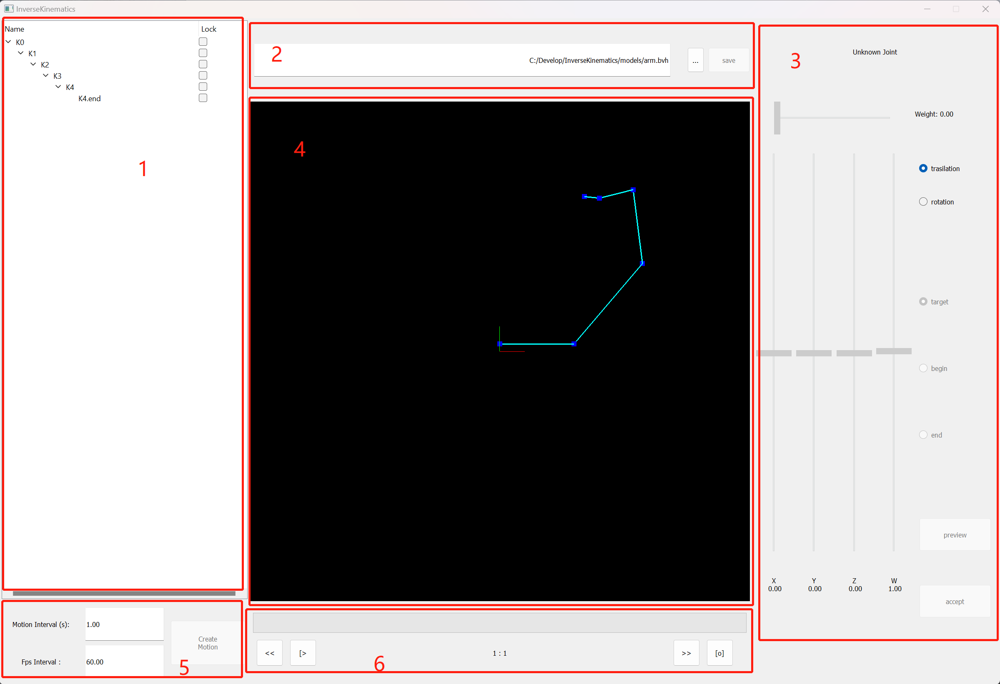

# InverseKinematics

## Description

This is a QT programe that is used to learn Inverse kniematics

## GUI help



- Joints Viewer [1]
  
  - Display all joints in a tree list.
  
  - U can select a joint and look more informations in widget 3 on the right side.
  
  - And U can toggle lock checkbox to set positional constrait adding a motion by IK.

- File Picker [2]
  
  - Cilck button '...' to open a .bvh file.
  
  - Click button 'save' after U adding some motions

- Joint Editer [3]
  
  - Display joints' name, offets and rotation angles
  
  - Set up the weight that be used for joints control
  
  - Set up a movement Bezeir path by 'target'. 'begin' and 'end'

- BVH model displayer [4]

  - Display the model in BVH file at any frame

  - U can drag this widget to rotate the model

- Motion Adder [5]

  - Add a motion from currented selected joint, U can set how long the movement will last and the FPS of the movement.

- Play Bar [6]

  - Show current frame id

  - Start play, stop play, reset play, jump to next frame and jump to prev frame

## How to build and run

- Windows
  
  - Download Qt5 and open InverseKinematics.pro, setup complier and click Run.

- Linux or MaxOS
  - intall qt5
  - use qmake and make to compile
  ```
    // build
    $ mkdir build && cd build
    $ qmake ../InverseKinematics.pro
    $ make -j20
    // run on linux
    $ ./InverseKinematics
    // run on MacOs
    $ ./InverseKinematics.app/Contents/MacOS/InverseKinematics
  ```